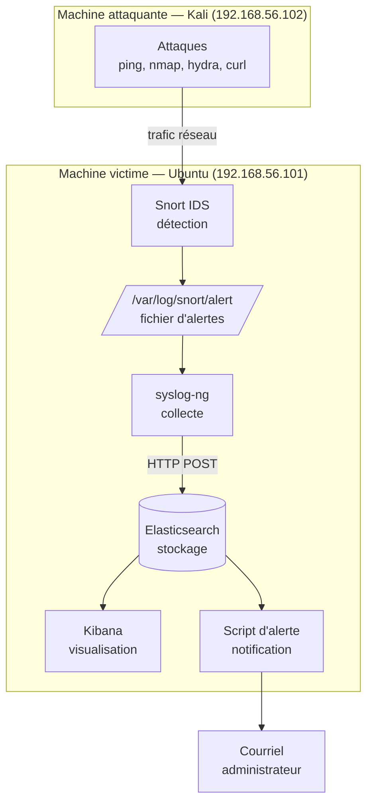

# Projet Sécurité Informatique : Détection d'intrusions (8INF857)

Mini centre de surveillance de sécurité (SOC) : détecter des attaques réseau,
les collecter, les stocker, les visualiser et alerter l'administrateur.

Projet réalisé dans le cadre du cours **8INF857 Sécurité informatique** (UQAC).

## Principe

Une machine attaquante (Kali) lance des attaques contre une machine victime
(Ubuntu). L'IDS Snort les détecte, syslog-ng transporte les alertes,
Elasticsearch les stocke, Kibana les affiche, et un script notifie l'administrateur.



## Fonctionnalités

- **5 scénarios d'attaque détectés** : balayage ICMP (ping), scan de ports (nmap),
  force brute SSH (hydra), parcours de répertoires et injection SQL.
- **Collecte centralisée** des alertes Snort vers Elasticsearch via syslog-ng.
- **Tableau de bord Kibana** : répartition par type d'attaque, évolution dans le
  temps, et tableau récapitulatif.
- **Notification** de l'administrateur par courriel lors d'une détection.

## Environnement

| Élément            | Valeur                      |
|--------------------|-----------------------------|
| Machine victime    | Ubuntu Desktop 24.04, 192.168.56.101 |
| Machine attaquante | Kali Linux, 192.168.56.102  |
| IDS                | Snort 2.9                   |
| Pile ELK           | Elasticsearch + Kibana 8.14 (Docker) |
| Réseau             | host-only VirtualBox (192.168.56.0/24) |

## Structure du dépôt

```
Projet1_secu_info/
├── README.md              Présentation (ce fichier)
├── docker/
│   └── docker-compose.yml  Elasticsearch + Kibana
├── config/
│   ├── contrat.md          Valeurs partagées de l'équipe
│   ├── snort-local.rules   Les 5 règles de détection
│   └── syslog-ng.conf      Envoi des alertes vers Elasticsearch
├── scripts/
│   └── alerte.py           Notification courriel
├── docs/
│   ├── installation.md     Guide d'installation pas à pas
│   ├── utilisation.md      Comment rejouer les scénarios
│   ├── scenarios.md        Les 5 attaques détaillées
│   └── conclusion.md       Analyse, limites et améliorations
└── captures/               Captures d'écran Kibana
```

## Démarrage rapide

Le détail complet est dans [docs/installation.md](docs/installation.md).

```bash
# Sur la machine victime (Ubuntu)
git clone https://github.com/benadibakeren/Projet1_secu_info.git
cd Projet1_secu_info/docker
docker compose up -d
```

Puis ouvrir Kibana sur `http://192.168.56.101:5601`.

## Documentation

- [Installation](docs/installation.md) — monter l'environnement de zéro
- [Utilisation](docs/utilisation.md) — rejouer les attaques et vérifier la détection
- [Scénarios](docs/scenarios.md) — les 5 attaques, règles Snort et contre-mesures
- [Conclusion](docs/conclusion.md) — analyse, limites, perspectives

## Équipe

Projet de groupe : 
- BENADIBA Keren
- LENNE Luc
- ZOZOR Matthieu

Cours 8INF857, UQAC, automne 2026.

