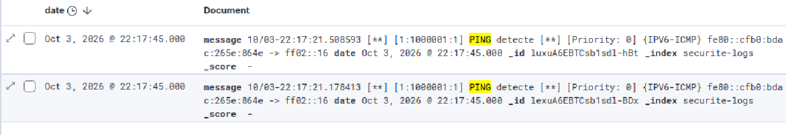
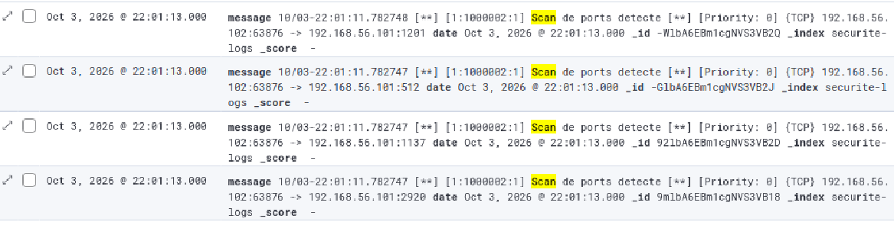
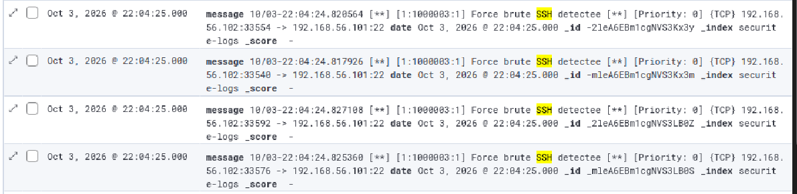
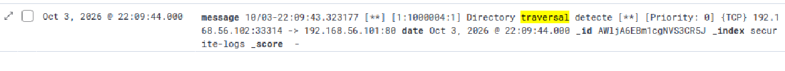
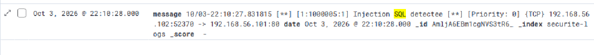

# Scénarios d'intrusion et visualisation

Cinq règles Snort sont définies dans `config/snort-local.rules`, une par scénario. Toutes surveillent le trafic entrant vers `$HOME_NET`.

> Les commandes ci-dessous sont **suggérées** pour déclencher chaque règle sur le test. Remplacer par celles réellement utilisées si elles diffèrent.
> À exécuter uniquement contre vos propres VM de laboratoire.

| # | Scénario | Règle (sid) | Condition de déclenchement |
|---|---|---|---|
| 1 | Ping (reconnaissance) | 1000001 | Tout paquet ICMP vers la victime |
| 2 | Scan de ports | 1000002 | 20 paquets SYN ou plus depuis une même source en 3 s |
| 3 | Force brute SSH | 1000003 | 5 paquets SYN ou plus vers le port 22 en 10 s |
| 4 | Directory traversal | 1000004 | Chaîne `../` dans le trafic vers le port 80 |
| 5 | Injection SQL | 1000005 | Chaîne `1=1` dans le trafic vers le port 80 |

## Scénario 1 — Ping

- **Objectif de l'attaquant** : vérifier qu'une machine est active.
- **Attaque (Kali)** : `ping -c 4 <IP_UBUNTU>`
- **Alerte attendue** : `PING detecte`
- **Capture** : 

## Scénario 2 — Scan de ports

- **Objectif** : découvrir les services ouverts.
- **Attaque (Kali)** : `nmap -sS <IP_UBUNTU>`
- **Alerte attendue** : `Scan de ports detecte` (seuil via `detection_filter`)
- **Capture** : 

## Scénario 3 — Force brute SSH

- **Objectif** : deviner des identifiants SSH par tentatives répétées.
- **Attaque (Kali)** : plusieurs tentatives de connexion rapides au port 22, par exemple `for i in $(seq 1 10); do ssh -o ConnectTimeout=2 test@<IP_UBUNTU> true; done`
- **Alerte attendue** : `Force brute SSH detectee`
- **Capture** : 

## Scénario 4 — Directory traversal

- **Objectif** : lire des fichiers hors de la racine web.
- **Attaque (Kali)** : `curl --path-as-is "http://<IP_UBUNTU>/../../etc/passwd"`
- **Alerte attendue** : `Directory traversal detecte`
- **Capture** : 

## Scénario 5 — Injection SQL

- **Objectif** : altérer une requête SQL via un paramètre.
- **Attaque (Kali)** : `curl "http://<IP_UBUNTU>/?id=1%20OR%201=1"`
- **Alerte attendue** : `Injection SQL detectee`
- **Capture** : 

## Lire les captures Kibana

Chaque document de l'index `securite-logs` contient `date` et `message`. Une ligne d'alerte se lit ainsi :

```
10/09-12:00:00.123456  [**] [1:1000002:1] Scan de ports detecte [**] [Priority: 0] {TCP} <IP_KALI>:54321 -> <IP_UBUNTU>:80
```

| Élément | Signification |
|---|---|
| `[1:1000002:1]` | génération:sid:révision de la règle déclenchée |
| texte après le sid | nom de l'alerte |
| `Priority` | gravité attribuée |
| `{TCP}` / `{ICMP}` | protocole |
| `src -> dest` | source de l'attaque et cible |

Pour analyser une intrusion dans **Discover** :

1. Regarder **quand** : un pic dans l'histogramme indique une rafale.
2. Lire **qui attaque** et **qui est visé** dans `message`.
3. Compter les alertes d'un même type pour distinguer un événement isolé d'une attaque répétée.
4. Corréler avec d'autres alertes de la même source.
